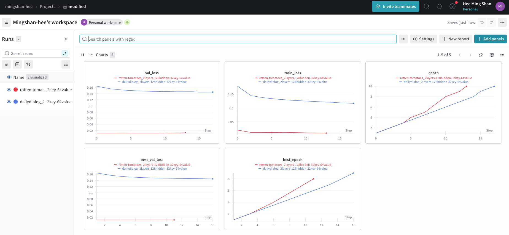

## Problem Statement
Given the provided SimpleRNN implementation, analyze its performance characteristics and optimize it for efficient training and inference.

## Setup instructions

### Environment Setup

1. Create an Conda environment and install the required Python packages

```bash
conda create --name SimpleRNN python=3.12
pip3 install -r requirements.txt
```

### Training Scripts

You may find the training scripts within the `scripts` folder. Once you locate the script, run using the following command.

```
# For example, rotten-tomatoes
bash scripts/rotten-tomatoes-simple.sh
```

### Benchmark Scripts

Run the following scripts

```
bash benchmark.sh
```

## Key Findings

### Training Optimisation #1

**Issue**
Each timestep involves four separate Linear projection operations, resulting in considerable computational overhead.

**Resolution**:
- Projection Fusion: Combine all projections into a single matrix multiplication, then split the output into query, key, gate, and value components.

### Training Optimisation #2

**Issue**
The current forward method in SimpleRNN processes one data point at a time, leading to inefficient training.

**Resolution**:
- Batch Processing: Enable the model to process multiple sentences in parallel.
- Dynamic Batch Sizing: Adjust batch sizes according to the longest sequence within each batch to optimise resource usage.
- Dataloader: Spawn multiple background worker processes to prepare data while the GPU is busy training.

### Memory Optimsation #1

**Issue**
Frequent layer calls can become costly for long sequences.

**Resolution**:
- Checkpointing: Introduce a configurable flag to perform gradient checkpointing every K timesteps to reduce memory consumption.

### Inference Optimisation #1:

**Issue**
The current forward function requires the full sequence at each timestep and only returns logits for the entire sequence, limiting efficiency during inference.

**Resolution**:
- Stepwise Inference: Modify the model to output the `cell_state` for a given prefix input (e.g., <en> I love apple <ja>), enabling re-use and incremental updates of `cell_state` for subsequent prediction steps.

## Performance metrics

The models are run with the following settings:
- vocab_size = 512
- hidden_dim = 128
- key_dim = 32
- value_dim = 64
- output_dim = 128
- num_layers = 2

### Memory & Training Efficiency

The inputs are as follows:
```python
size, seq_length = 256, 512
x = torch.randint(0, vocab_size, (size, seq_length))
```

| S/N | Modifications.                   | Improvement Cat. | Runtime duration        | Peak memory usage |
| --- | -------------------------------- | ---------------- | ----------------------- | ----------------- |
| 1   | Simple (Batch = 1)               | N/A              | 3.1519 ± 0.0358 seconds | 20.51 ± 0.00 MB   |
| 2   | Batch Processing (Batch = 32)    | Runtime          | 0.4370 ± 0.0542 seconds | 2565.50 ± 7.36 MB |
| 4   | 2 + Fused Projection (Batch = 1) | Runtime          | 0.4283 ± 0.0570 seconds | 2565.50 ± 7.36 MB |
| 3   | 2 + 3 + Gradient Checkpointing   | Memory           | 0.3770 ± 0.2039 seconds | 136.69 ± 0.75 MB  |

### Inference Efficiency

The inputs are as follows:
```python
size, seq_length = 1, 256
x = torch.randint(0, vocab_size, (size, seq_length))
```

The benchmark is conducted by generating 100 new tokens, starting with a prefix sequence of length 256 tokens.

| S/N | Modifications.                 | Improvement Cat. | Runtime duration        | Peak memory usage |
| --- | ------------------------------ | ---------------- | ----------------------- | ----------------- |
| 1   | Simple (Batch = 1)             | N/A              | 5.4187 ± 0.0441 seconds | 24.61 ± 0.00 MB   |
| 2   | Stepwise Inference (Batch = 1) | Runtime          | 0.2082 ± 0.0430 seconds | 49.74 ± 0.00 MB   |

### Benchmark Performance

The model are only trained for 10 epochs due to the time constraint. 

Note: Looking at the loss, dailydialog dataset still hasn't converged. Can show the wandb plots during interview.

#### Rotten Tomato

| Model    | Acc        | F1         |
| -------- | ---------- | ---------- |
| Simple   | 0.5146     | 0.4146     |
| Modified | **0.5807** | **0.5807** |

#### Daily Dialogue

| Model    | Valid       | BLEU       | ROUGE-1    | ROUGE-2    | ROUGE-L    | BERTScore Precision | BERTScore Recall | BERTScore F1 |
| -------- | ----------- | ---------- | ---------- | ---------- | ---------- | ------------------- | ---------------- | ------------ |
| Simple   | 999 / 1000  | 0.0129     | **0.1028** | 0.0163     | **0.0995** | 0.7093              | **0.6837**       | **0.6954**   |
| Modified | 1000 / 1000 | **0.0132** | 0.1005     | **0.0259** | 0.0987     | **0.7162**          | 0.6709           | 0.6920       |

#### Training Plot (Modified RNN)



## Discussions

### Architecture Comparison
Compare **Self-Attention** vs **SimpleRNN** in terms of:
- **Computational complexity** (Big-O analysis)  
  - **SimpleRNN** needs to be sequential as each time step depends on the previous one. Hence, it has a Big-O complexity of **O(T · H²)**, where it is linear in sequence length `T`, quadratic in hidden size `H`. 
  - **Self-Attention** allows each token to attend to all others simultaneously, enabling full parallelism. Hence, it has a Big-O complexity of **O(T² · H)** — quadratic in sequence length `T`, linear in hidden size `H`.

- **Parallelization potential** 
  - Both SimpleRNN and Self-Attention support data parallelism, 
  - However, Self-Attention offers significantly greater scalability in a multi-node, multi-GPU setting. Self-Attention processes all tokens simultaneously without sequential dependencies, allowing efficient use of parallel training strategies. In contrast, SimpleRNNs require step-by-step computation, which limits GPU utilization and slows down training

- **Long-range dependency modeling**  
  - Self-Attention outperforms SimpleRNN in modeling long-range dependencies by allowing each token to directly access all others, enabling stronger and more explicit global context understanding. In contrast, SimpleRNN processes inputs sequentially, causing earlier information to degrade over time, which limits its ability to capture distant relationships effectively.
- **Memory scaling** with sequence length  
  - Self-Attention has a quadratic memory complexity of $O(L^2 \cdot d)$, as it computes interactions between all pairs of tokens, resulting in an attention matrix that grows rapidly with longer sequences. 
  - SimpleRNN exhibits linear memory complexity of $O(L \cdot d)$, since it processes tokens sequentially and only stores per-step hidden states.
- **Training characteristics**  
  - Gradient Flow and Stability
    - Self-Attention has direct connections across all positions allow better gradient flow, making it less prone to vanishing or exploding gradients.
    - SimpleRNN suffers from unstable gradients due to deep temporal recursion, causing training to be numerically unstable for long sequences without gating mechanisms or clipping.

### Scaling Discussion
To scale SimpleRNN training across multiple GPUs effectively, we can consider doing the following:

1. **Data Parallelism**:
- Use `torch.nn.DistributedDataParallel (DDP)` for efficient and scalable training, as it minimizes overhead compared to `torch.nn.DataParallel`.
  - DDP split the input batch across GPUs, run forward and backward passes independently, and then synchronize gradients.

2. **Efficient Batch**:
- Pad sequences within each mini-batch to similar lengths to minimize idle time across GPUs.
  - Use bucketing to group similar-length sequences, improving computational efficiency.

3. **Model Sharding**:
- When the model is too large to fit on a single GPU, place different layers (or parts of the model) are placed on different GPUs.
- *Caveat: SimpleRNNs are typically lightweight; this method adds communication overhead and is less beneficial unless the model is very deep or memory-intensive.*

## Expected Deliverables
[X] **Optimized SimpleRNN** with documented performance improvements  
[X] **Benchmark results** comparing original vs optimized versions  
[X] **Training demonstration** on sample data showcasing improvements 
[X] **Technical analysis** covering architecture comparisons and scaling strategies  
[X] **Clean, well-documented code** with explanations for each optimization